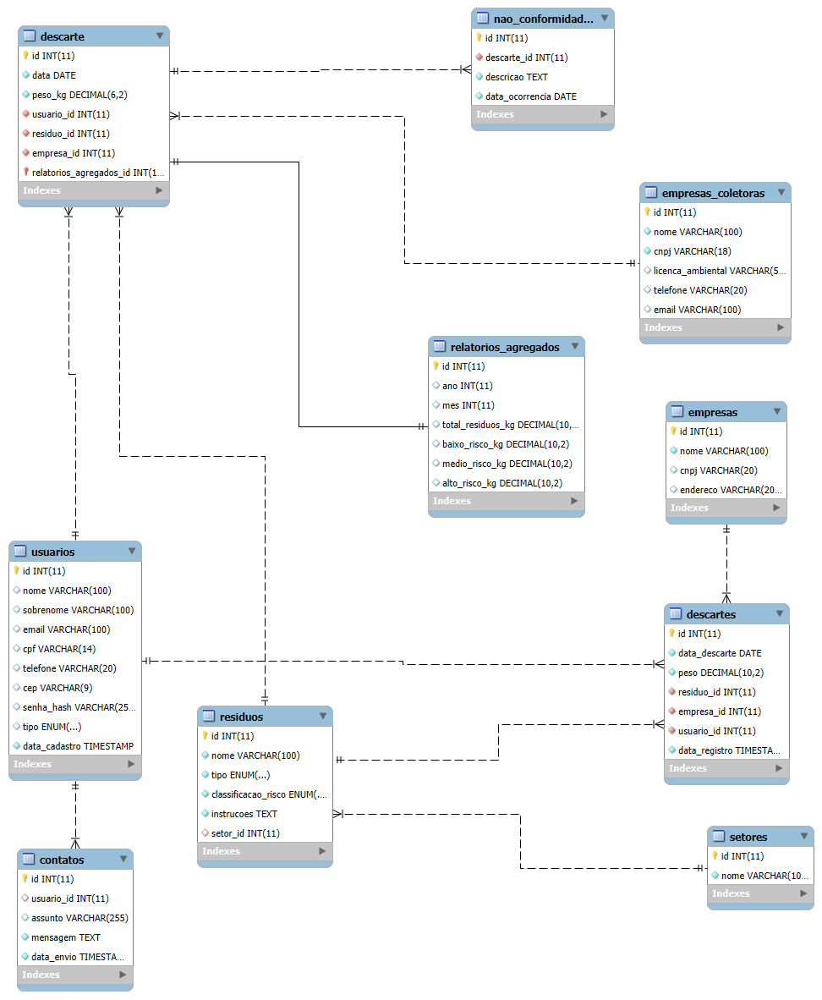

# 🏥 Medcycle

[]()

Sistema web para **gerenciamento do descarte de resíduos médicos**, promovendo práticas mais seguras em ambientes hospitalares e de saúde.

---

## 📌 Descrição

O **Medcycle** permite cadastrar, monitorar e controlar o descarte de resíduos hospitalares, promovendo responsabilidade ambiental e cumprimento de normas de segurança sanitária.

---

## 🧩 Modelo de Dados

O sistema utiliza um banco de dados relacional para gerenciar informações sobre resíduos, empresas, usuários, setores, não conformidades e relatórios agregados. Abaixo está o diagrama do modelo lógico:



Principais entidades:

- **residuos**: armazena o tipo e classificação dos resíduos  
- **descartes**: registra cada ato de descarte de resíduos  
- **usuarios**: profissionais responsáveis pelos descartes  
- **empresas** e **empresas_coletoras**: instituições de origem e coleta  
- **setores**: departamentos hospitalares  
- **nao_conformidades**: registros de ocorrências irregulares  
- **relatorios_agregados**: consolidação de dados por risco  
- **contatos**: sistema de suporte e mensagens  

---

## 🚀 Como executar

1. Clone o repositório:
   ```bash
   git clone https://github.com/Magnumja/DAC.git
   cd DAC

2. Execute o projeto:
   ```bash
   python app.py
   
É necessário ter o Python 3.10+ instalado em sua máquina.

## 📁 Estrutura do Projeto

DAC/
├── app.py
├── database.db
├── templates/
│   ├── index.html
│   └── login.html
├── diagrama.png
└── README.md


## 👨‍💻 Autores

| Nome   | GitHub                                         |
| ------ | ---------------------------------------------- |
| Magnum | [@Magnumja](https://github.com/Magnumja)       |
| Murilo | [@muLocatelli](https://github.com/muLocatelli) |
| Bianca | [@BiaSabka](https://github.com/BiaSabka)       |
| David  | [@davidleites](https://github.com/davidleites) |
|  Mike  | [@MikeWeyller](https://github.com/MikeWeyller) |

Desenvolvido com 💻 por estudantes comprometidos com a saúde e o meio ambiente.


---


